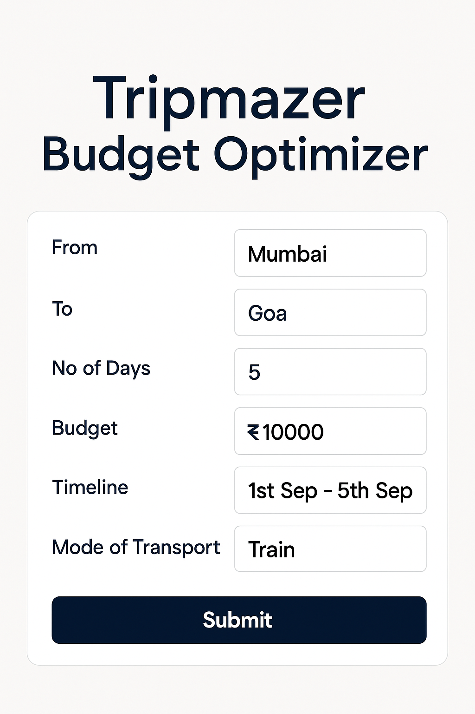
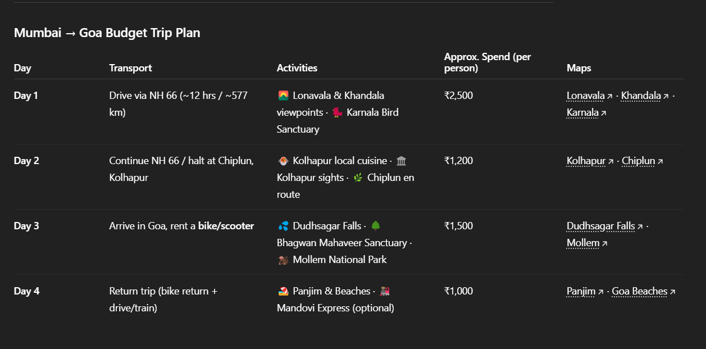

# TripMazer Research - AI-Powered Trip Planning System

## 🌟 Overview
TripMazer is an advanced AI-powered trip planning system that uses multi-agent architecture with LangGraph to intelligently optimize travel itineraries, budgets, and recommendations. The system employs LLM-based preference extraction and intelligent routing to provide comprehensive travel planning solutions.

## **Streamlit Web Application**

### **Quick Start - Running the Application**

The primary way to use TripMazer is through our **dark-themed Streamlit web interface** with green terminal-style output:

#### **Features:**
- **🎯 Complete Trip Planning**: Multi-transport search with real-time cost comparison
- **🏨 Smart Accommodations**: AI-powered hotel recommendations
- **🍽️ Restaurant Discovery**: Dining suggestions based on your itinerary
- **🗺️ Intelligent Itinerary**: Detailed day-by-day trip planning
- **💬 AI Chat Assistant**: Comprehensive trip planning with multi-agent system
- **🌚 Dark Theme**: Black background with green text for better visibility

### 📋 **Setup Instructions**

#### **1. Clone the Repository**
```bash
git clone https://github.com/Sukruth097/TripMazerResearch.git
cd TripMazerResearch
```

#### **2. Install Dependencies**
```bash
pip install -r src/requirements.txt
```

#### **3. Configure Environment Variables**
Create a `.env` file in the `src` directory:
```bash
# Copy the template
cp .env.template src/.env
```

Edit `src/.env` with your API keys:
```env
# Required API Keys
PERPLEXITY_API_KEY=your_perplexity_api_key_here
GEMINI_API_KEY=your_gemini_api_key_here  
SERP_API_KEY=your_serp_api_key_here

# Optional Azure Configuration
AZURE_STORAGE_CONNECTION_STRING=your_azure_storage_connection_string_here
AZURE_KEY_VAULT_URL=your_azure_key_vault_url_here
```

#### **4. Run the Application**
```bash
cd src
streamlit run main.py
```

#### **5. Access the Application**
Open your browser and go to: **http://localhost:8501**

### 🔑 **Getting API Keys**

#### **Perplexity AI** (For restaurant and accommodation search)
1. Sign up at: https://www.perplexity.ai/
2. Get API key from your dashboard  
3. Add to `.env` as `PERPLEXITY_API_KEY`

#### **Google Gemini** (For natural language processing)
1. Get API key from: https://makersuite.google.com/app/apikey
2. Add to `.env` as `GEMINI_API_KEY`

#### **SerpAPI** (For flights and bus search)
1. Sign up at: https://serpapi.com/
2. Get API key from your dashboard
3. Add to `.env` as `SERP_API_KEY`

### 🎮 **How to Use the Application**

#### **Method 1: Individual Planning Tools**
1. **🎯 Trip Planning** → Enter source, destination, dates, budget
2. **🏨 Accommodations** → Get personalized hotel options  
3. **🍽️ Restaurants** → Find dining based on itinerary or manual search
4. **🗺️ Itinerary** → Create detailed day-by-day plans

#### **Method 2: AI Chat Assistant (Recommended)**
1. Go to **💬 Chat Assistant** section
2. Ask for comprehensive trip planning like:
   ```
   Plan a trip for 3 people of budget 50000 INR from Bangalore to Mumbai 
   on 27-11-25 to 30-11-25, we prefer flights over trains and we like 
   beaches and early sunrise view points, plan itinerary accordingly
   ```
3. The AI agent will automatically:
   - Extract your preferences using Gemini AI
   - Allocate budget intelligently across tools
   - Execute itinerary → travel → accommodation → restaurant planning
   - Combine results into a comprehensive trip report

#### **Sample Queries for Chat Assistant:**
```bash
# Family Trip
"Plan a family trip for 4 people from Delhi to Goa with budget 80000 INR from 15-12-2025 to 20-12-2025, we prefer comfortable stays and good food"

# Adventure Trip  
"Plan an adventure trip for 2 people from Mumbai to Manali with budget 45000 INR, we love trekking and mountain views"

# Business Trip
"Plan a business trip from Bangalore to Chennai for 1 person with budget 25000 INR for 2 days, need good hotels near the airport"
```

### 🎨 **User Interface**

#### **Dark Theme Features:**
- **🖤 Black background** throughout the application
- **🟢 Green text** for all content, headers, and results  
- **🟢 Green-bordered inputs** and interactive elements
- **🌈 Color-coded messages**:
  - 🟢 Success messages (green)
  - 🔵 Info messages (cyan)  
  - 🟡 Warning messages (yellow)
  - 🔴 Error messages (red)

#### **Navigation:**
- **Sidebar navigation** for easy section switching
- **Responsive design** that works on desktop and mobile
- **Progress indicators** during AI processing
- **Session state management** to preserve data between sections

---

## 🚀 Advanced Usage (CLI/Original)

### Prerequisites
- Python 3.9+ installed on your system
- Git (for cloning the repository)

### Setup Instructions

1. **Clone the Repository**
```bash
git clone https://github.com/Sukruth097/TripMazerResearch.git
cd TripMazerResearch
```

2. **Create Virtual Environment**
```bash
python -m venv venv
```

3. **Activate Virtual Environment**
```bash
# Windows
source venv/Scripts/activate

# macOS/Linux
source venv/bin/activate
```

4. **Install Dependencies**
```bash
pip install -r src/requirements.txt
```

5. **Run the Trip Optimization Agent**
```bash
python src/agents/worker/trip_optimization_agent/agent.py
```

### Environment Configuration
Create a `.env` file in the root directory with your API keys:
```env
PERPLEXITY_API_KEY=your_perplexity_api_key_here
```

## 🏗️ System Architecture

### High-Level Architecture

The TripMazer system follows a multi-agent architecture built on LangGraph, providing intelligent routing and state management for comprehensive trip planning.

```
┌─────────────────────────────────────────────────────────────┐
│                    TripMazer System                         │
├─────────────────────────────────────────────────────────────┤
│  User Query (Natural Language)                             │
│  ↓                                                         │
│  ┌─────────────────────────────────────┐                   │
│  │     Trip Optimization Agent         │                   │
│  │     (LangGraph Orchestrator)        │                   │
│  └─────────────────────────────────────┘                   │
│  ↓                                                         │
│  ┌─────────────────────────────────────┐                   │
│  │     LLM-Based Preference            │                   │
│  │     Extraction & Routing            │                   │
│  └─────────────────────────────────────┘                   │
│  ↓                                                         │
│  ┌─────────────────────────────────────┐                   │
│  │     State Management System         │                   │
│  │     (Budget + Execution Tracking)   │                   │
│  └─────────────────────────────────────┘                   │
│  ↓                                                         │
│  ┌─────────────────────────────────────┐                   │
│  │        Optimization Tools           │                   │
│  │  ┌─────┐ ┌─────┐ ┌─────┐ ┌─────┐   │                   │
│  │  │ Acc │ │ Itn │ │ Rst │ │ Trv │   │                   │
│  │  └─────┘ └─────┘ └─────┘ └─────┘   │                   │
│  └─────────────────────────────────────┘                   │
│  ↓                                                         │
│  ┌─────────────────────────────────────┐                   │
│  │     Perplexity AI Service           │                   │
│  │     (Real-time Information)         │                   │
│  └─────────────────────────────────────┘                   │
│  ↓                                                         │
│  Comprehensive Trip Report (Markdown)                      │
└─────────────────────────────────────────────────────────────┘
```

### Core Components

1. **Trip Optimization Agent**: Main orchestrator using LangGraph StateGraph
2. **LLM-Based Preference Extraction**: Intelligent parsing of natural language queries
3. **State Management System**: Tracks budget allocation and execution state
4. **Optimization Tools**: Specialized agents for different aspects of trip planning
5. **Perplexity AI Service**: External API for real-time travel information

## 📋 Low-Level Design (LLD)

### 1. Trip Optimization Agent (`agent.py`)

**Class: TripOptimizationAgent**

**Responsibilities:**
- Orchestrate multi-agent workflow using LangGraph
- Manage state transitions and budget allocation
- Route requests to appropriate optimization tools
- Combine results into comprehensive reports

**Key Methods:**
```python
__init__()                              # Initialize agent with tools and graph
_extract_preferences_and_routing()      # LLM-based preference extraction
_allocate_budget()                      # Intelligent budget distribution
_build_graph()                          # Construct LangGraph workflow
_execute_current_tool()                 # Execute optimization tools
plan_trip()                             # Main entry point for trip planning
```

**State Flow:**
```
Input Processing → Budget Allocation → Tool Execution → 
Budget Tracking → Result Combination → Output Formatting
```

### 2. State Management System (`state_manager.py`)

**Class: StateManager**

**Data Structure: TripState (TypedDict)**
```python
{
    original_query: str
    user_preferences: Dict[str, Any]
    total_budget: float
    remaining_budget: float
    currency: str
    dates: str
    from_location: str
    to_location: str
    travelers: int
    tool_sequence: List[str]
    current_step: int
    budget_allocation: Dict[str, float]
    spent_amounts: Dict[str, float]
    accommodation_result: str
    itinerary_result: str
    restaurant_result: str
    travel_result: str
    combined_result: str
    completed_tools: List[str]
    warnings: List[str]
    errors: List[str]
    retry_count: int
}
```

**Key Operations:**
- Budget allocation and tracking
- Tool execution sequence management
- State persistence and recovery
- Error and warning collection

### 3. Optimization Tools

#### A. Accommodation Planner (`AccommodationPlanner.py`)
**Function: search_accommodations()**
- **Input**: Natural language query with budget constraints
- **Processing**: LLM-based extraction of accommodation preferences
- **Output**: Structured accommodation recommendations with pricing

#### B. Itinerary Planner (`ItineraryPlanning.py`)
**Function: plan_itinerary()**
- **Input**: Destination, dates, budget, preferences
- **Processing**: Day-by-day schedule creation with Google Maps integration
- **Output**: Markdown table with Time|Activity|Details|Maps format

#### C. Restaurant Search (`RestaurantsSearch.py`)
**Function: search_restaurants()**
- **Input**: Itinerary details, dates, dietary preferences
- **Processing**: Location-based restaurant recommendations
- **Output**: Restaurant suggestions with cuisine types and pricing

#### D. Travel Optimization (`TravelOptimization.py`)
**Function: optimize_travel()**
- **Input**: Route requirements, budget, transport preferences
- **Processing**: Multi-modal transport analysis
- **Output**: Optimized travel routes with cost/time comparison

### 4. LLM-Based Preference Extraction

**System Prompt Structure:**
```
Role Definition → Task Specification → Output Format → 
Constraint Rules → Example Patterns → Validation Requirements
```

**Extraction Categories:**
- Budget and currency detection
- Date range parsing
- Location identification
- Traveler count analysis
- Priority routing determination

**Fallback Mechanism:**
- Primary: LLM-based extraction with structured prompts
- Fallback: Keyword-based pattern matching
- Error Handling: Default value assignment

### 5. Integration Layer

**Perplexity Service (`perplexity_service.py`)**
- **API Endpoint**: https://api.perplexity.ai/chat/completions
- **Authentication**: API key-based
- **Response Processing**: JSON parsing with error handling
- **Rate Limiting**: Built-in retry mechanisms

**Tool Orchestration (`__init__.py`)**
- Centralized tool imports
- Workflow management functions
- Error propagation and handling

### 6. Data Flow Architecture

**Request Processing Pipeline:**
```
1. Natural Language Query
   ↓
2. LLM Preference Extraction
   ↓
3. Budget Allocation
   ↓
4. Tool Routing & Execution
   ↓
5. State Tracking & Updates
   ↓
6. Result Aggregation
   ↓
7. Comprehensive Report Generation
```

**State Transition Model:**
```
INIT → INPUT_PROCESSING → BUDGET_ALLOCATION → 
TOOL_EXECUTION → BUDGET_TRACKING → RESULT_COMBINATION → 
OUTPUT_FORMATTING → COMPLETE
```

**Error Handling Strategy:**
- Tool-level error isolation
- State rollback capabilities
- Graceful degradation with warnings
- Comprehensive error logging

### User Input Template

#### Mandatory Fields
- **FROM**: Starting location of the trip. (e.g., Mumbai)
- **TO**: Destination location. (e.g., Goa)
- **NO OF DAYS**: Total duration of the trip in days. (e.g., 5)
- **BUDGET**: Total budget for the trip. (e.g., ₹20,000)
- **TIMELINE**: Preferred travel dates or period. (e.g., 1st Sep - 5th Sep)

#### Optional Fields
- **Mode of Transport**: Preferred transportation (flight, train, bus, car, etc.)
- **Stay Preferences**: Accommodation type (hotel, hostel, resort, etc.)

### Technical Stack
- **LangGraph (Agent)**: For agent-based workflow orchestration and advanced reasoning
- **LLM**: Claude or GPT models for itinerary generation and recommendations
- **Search**: Google Search or Perplexity for real-time travel information
- **Google Maps API / MapmyIndia API**: For route visualization, POI mapping, and location intelligence

---

# Example

**Step 1: User Input**

```To generate a personalized itinerary, the user must fill in the mandatory and optional parameters in the template.```




**Step 2: System Response**

```Once the required information is submitted, the system processes the input and returns an optimized itinerary in table format.```



## 🔧 Development & Testing

### Running Individual Tools

Test individual optimization tools:
```bash
# Test Accommodation Planner
python src/tools/optimization/AccommodationPlanner.py

# Test Itinerary Planner
python src/tools/optimization/ItineraryPlanning.py

# Test Restaurant Search
python src/tools/optimization/RestaurantsSearch.py

# Test Travel Optimization
python src/tools/optimization/TravelOptimization.py
```

### Configuration Files

**Requirements Management:**
- `src/requirements.txt`: Python dependencies
- `.env`: Environment variables (API keys)

**Agent Configuration:**
- `src/config/configurations.py`: System configurations
- `src/entity/config_entity.py`: Pydantic data models

### Project Structure
```
TripMazerResearch/
├── README.md                           # This documentation
├── .env.template                       # Environment variables template
├── src/
│   ├── main.py                         # 🎯 Main Streamlit Application
│   ├── requirements.txt                # Python dependencies
│   ├── .env                           # Your API keys (create from template)
│   ├── agents/
│   │   └── worker/
│   │       └── trip_optimization_agent/
│   │           └── agent.py           # 🤖 Main AI agent orchestrator
│   ├── tools/
│   │   └── optimization/
│   │       ├── TravelOptimization.py  # 🚌 Transport optimization
│   │       ├── AccomidationPlanner.py # 🏨 Hotel/stay search
│   │       ├── RestaurantsSearch.py   # 🍽️ Dining recommendations
│   │       └── IternaryPlanning.py    # 🗺️ Day-by-day planning
│   ├── services/
│   │   ├── perplexity_service.py      # 🔍 Perplexity AI service
│   │   └── serp_api_service.py        # ✈️ Flight/bus search service
│   ├── state/
│   │   └── state_manager.py           # 📊 State tracking system
│   └── utils/
│       └── common.py                  # 🛠️ Utility functions
├── database/
│   └── schemas/                       # Database schemas
├── Documentation/
└── images/                           # Screenshot examples
```

## 🔧 **Troubleshooting**

### **Common Issues and Solutions**

#### **1. Application Shows White/Blank Screen**
```bash
# Solution 1: Hard refresh browser
Ctrl+F5 (Windows) or Cmd+Shift+R (Mac)

# Solution 2: Clear browser cache and try different browser

# Solution 3: Check if Streamlit is running
# You should see: "You can now view your Streamlit app in your browser."
```

#### **2. Import Errors**
```bash
# Error: ModuleNotFoundError
# Solution: Install dependencies
pip install -r src/requirements.txt

# Error: "No module named 'src'"
# Solution: Make sure you're in the correct directory
cd TripMazerResearch/src
streamlit run main.py
```

#### **3. API Key Errors**
```bash
# Error: "API key not found" or "Authentication failed"
# Solution: Check your .env file in src directory

# Make sure file is named exactly: .env (not .env.txt)
# Verify API keys are correctly formatted:
PERPLEXITY_API_KEY=your_actual_key_here
GEMINI_API_KEY=your_actual_key_here
SERP_API_KEY=your_actual_key_here
```

#### **4. AI Agent Not Working**
```bash
# Error: "Agent Import Error" or "Limited Mode"
# Solution 1: Check all API keys are set correctly
# Solution 2: Verify internet connection
# Solution 3: Check API quotas haven't been exceeded

# You can still use individual planning tools if agent fails
```

#### **5. Dark Theme Not Showing**
```bash
# Solution: The app uses CSS injection
# Try refreshing the page or restarting Streamlit
cd src
streamlit run main.py
```

### **Getting Help**

#### **Debug Information**
1. Enable "Show Debug Info" checkbox in the app
2. Check browser Developer Tools (F12) for console errors
3. Look for error messages in the terminal where Streamlit is running

#### **Test Your Setup**
```bash
# Quick test - should show green text on black background
cd src
python -c "print('✅ Python working'); import streamlit; print('✅ Streamlit installed')"
```

#### **Check API Keys**
```bash
# Test if your .env file is readable
cd src
python -c "from dotenv import load_dotenv; import os; load_dotenv(); print('Perplexity:', 'SET' if os.getenv('PERPLEXITY_API_KEY') else 'NOT SET')"
```

---

## 📊 Example Usage
├── README.md
├── src/
│   ├── requirements.txt
│   ├── main.py
│   ├── agents/
│   │   └── worker/
│   │       └── trip_optimization_agent/
│   │           └── agent.py                 # Main agent orchestrator
│   ├── tools/
│   │   └── optimization/
│   │       ├── __init__.py                  # Tool registry
│   │       ├── AccommodationPlanner.py      # Hotel/stay search
│   │       ├── ItineraryPlanning.py         # Day-by-day planning
│   │       ├── RestaurantsSearch.py         # Dining recommendations
│   │       └── TravelOptimization.py        # Transport optimization
│   ├── state/
│   │   └── state_manager.py                 # State tracking system
│   ├── services/
│   │   └── perplexity_service.py           # LLM API service
│   ├── config/
│   │   └── configurations.py               # System settings
│   └── entity/
│       └── config_entity.py                # Data models
├── database/
│   └── schemas/                             # Database schemas
├── Documentation/
├── examples/
└── images/
```

## 📊 Example Usage

**Input Query:**
```
Plan a complete trip to Tokyo from Delhi for a couple from 25-12-2025 to 30-12-2025 
with budget $3000. We prefer temples, traditional experiences, and good food. 
We want comfortable accommodation and prefer trains over flights when possible.
```

**System Processing:**
1. **LLM Preference Extraction**: Identifies budget ($3000), travelers (2), preferences (temples, food)
2. **Intelligent Routing**: Prioritizes itinerary → travel → accommodation → restaurant
3. **Budget Allocation**: Distributes budget across tools (35% accommodation, 30% travel, 20% itinerary, 15% restaurant)
4. **Tool Execution**: Executes tools in priority order with budget constraints
5. **Result Combination**: Generates comprehensive markdown report

**Output Features:**
- Executive summary with budget breakdown
- Day-by-day itinerary tables
- Transportation optimization analysis
- Accommodation recommendations with pricing
- Restaurant suggestions based on itinerary locations
- Budget utilization tracking

---

# Example

**Step 1: User Input**

```To generate a personalized itinerary, the user must fill in the mandatory and optional parameters in the template.```


**Step 2: System Response**

```Once the required information is submitted, the system processes the input and returns an optimized itinerary in table format.```


---

## 🚀 Future Enhancements
- Support for multi-city trips
- Integration with booking APIs
- Real-time budget tracking
- User feedback and rating system
- Mobile application interface
- Advanced ML-based preference learning
- Integration with payment gateways
- Social sharing and collaboration features

---

## ⚠️ Limitations
- Dependent on accuracy of external APIs
- Budget estimates may vary
- Limited to supported locations and transport modes
- Requires stable internet connection for real-time data
- API rate limits may affect performance

---

## ⚡ **Quick Reference Commands**

### **Run the Application**
```bash
cd TripMazerResearch/src
streamlit run main.py
# Then open: http://localhost:8501
```

### **Setup from Scratch**
```bash
git clone https://github.com/Sukruth097/TripMazerResearch.git
cd TripMazerResearch
pip install -r src/requirements.txt
cp .env.template src/.env
# Edit src/.env with your API keys
cd src && streamlit run main.py
```

### **Troubleshooting**
```bash
# Check if everything is installed
cd src && python -c "import streamlit; print('✅ Ready')"

# Test API keys
python -c "from dotenv import load_dotenv; import os; load_dotenv(); print('Keys:', bool(os.getenv('PERPLEXITY_API_KEY')))"

# Force restart Streamlit
pkill -f streamlit
cd src && streamlit run main.py
```

---

## 🤝 Contributing
1. Fork the repository
2. Create a feature branch: `git checkout -b feature/AmazingFeature`
3. Commit your changes: `git commit -m 'Add some AmazingFeature'`
4. Push to the branch: `git push origin feature/AmazingFeature`
5. Open a Pull Request

---

## 📄 License
This project is licensed under the MIT License - see the LICENSE file for details.

---

## 📞 Support

### **Getting Help**
- 🐛 **Issues**: Open an issue on GitHub for bugs or feature requests
- 💬 **Discussions**: Use GitHub Discussions for questions and community support
- 📧 **Contact**: Reach out to the development team for direct support

### **Resources**
- 📖 **Documentation**: This README contains comprehensive setup and usage instructions
- 🎥 **Examples**: Check the `/images` folder for screenshots and examples
- 🔧 **Troubleshooting**: See the troubleshooting section above for common issues

---

## 🎉 **What's New in This Version**

- ✅ **Streamlit Web Interface** with dark theme and green terminal-style output
- ✅ **Comprehensive AI Chat Assistant** using multi-agent system
- ✅ **Individual Planning Tools** for step-by-step trip planning
- ✅ **Real-time Cost Comparison** across flights, trains, and buses
- ✅ **Budget-Aware Planning** with intelligent allocation
- ✅ **Session State Management** for seamless user experience
- ✅ **Mobile-Responsive Design** that works on all devices

---

**🌍 Built with ❤️ for travelers around the world**

**TripMazer - Your Intelligent AI Travel Companion** ✈️🤖
